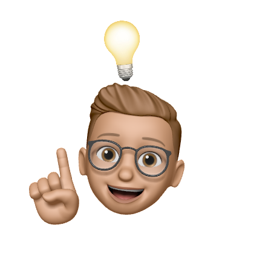

# Welcome, I'm Julien 👋🏽👨🏽‍💻

> I'm a `software engineer student` who is passionate about making contributing to open-source more approachable. I do love to learn new things and I'm always looking for new challenges. I'm interested in web development, mobile development, and game development. 

 

 

## 🌎 Find me around the web 🌎 
↪️ Interract with me on <a href="https://discord.com/users/384327361560182784">Discord</a>  
↪️ Sharing updates on <a href="https://www.linkedin.com/in/julien-von-der-marck/">LinkedIn</a> 
   

## ⭐ Look at my stats ⭐ 

